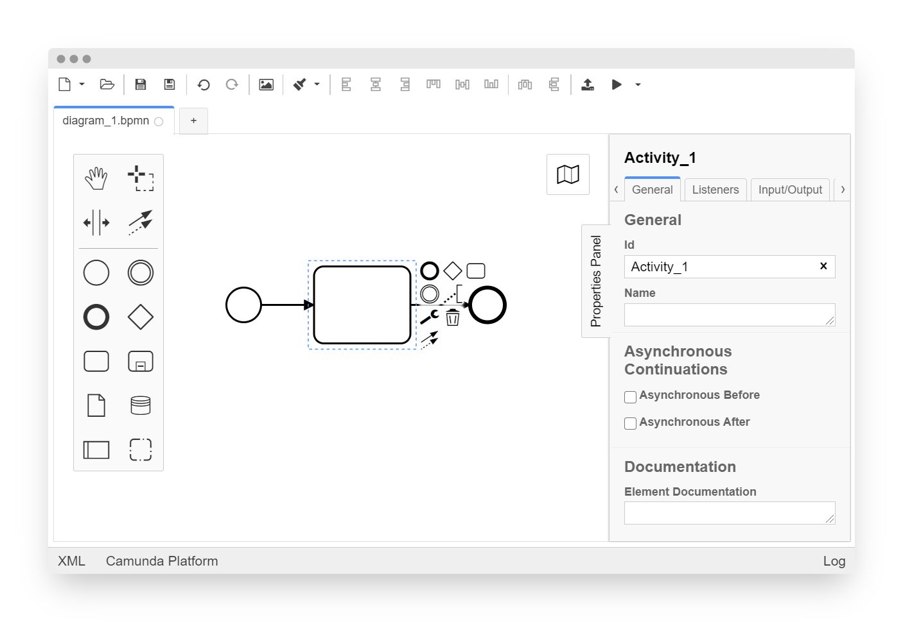

# Camunda Modeler

[](https://github.com/camunda/camunda-modeler/actions/workflows/CI.yml)

A desktop application for modeling BPMN diagrams, DMN decisions, and Forms, powered by [bpmn.io](https://bpmn.io/). Use it alongside your favorite IDE to implement solutions with [Camunda](https://camunda.com/).



## Resources

* [Changelog](./CHANGELOG.md)
* [Download](https://camunda.com/download/modeler/) (see also [nightly builds](https://downloads.camunda.cloud/release/camunda-modeler/nightly/))
* [Give Feedback](https://forum.camunda.io/c/bpmn-modeling/)
* [Report a Bug](https://github.com/camunda/camunda-modeler/issues)
* [User Documentation](https://docs.camunda.io/docs/components/modeler/desktop-modeler/)

## Building the Application

Build the app in a Posix environment. On Windows that is Git Bash or WSL. Make sure you have installed all the [necessary tools](https://github.com/nodejs/node-gyp#installation) to install and compile Node.js C++ addons.

```sh
# checkout a tag
git checkout main

# install dependencies
npm install

# execute all checks (lint, test and build)
npm run all

# build the application to ./dist
npm run build
```

### Development Setup

Spin up the application for development, all strings attached:

```sh
npm run dev
```

## Contributing

Please checkout our [contributing guidelines](./.github/CONTRIBUTING.md) if you plan to
file an issue or pull request.

## Code of Conduct

By participating to this project, please uphold to our [Code of Conduct](https://github.com/camunda/.github/blob/main/.github/CODE_OF_CONDUCT.md).

## License

MIT

Uses [bpmn-js](https://github.com/bpmn-io/bpmn-js), [dmn-js](https://github.com/bpmn-io/dmn-js), and [form-js](https://github.com/bpmn-io/form-js) licensed under the [bpmn.io license](http://bpmn.io/license).
