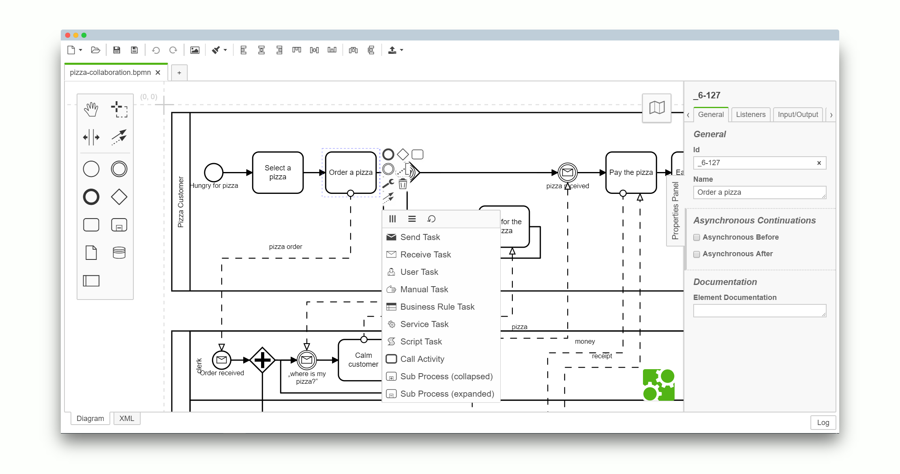

> Looking for the legacy [Camunda Eclipse plug-in](https://github.com/camunda/camunda-eclipse-plugin)?


# Camunda Modeler

[](https://travis-ci.org/camunda/camunda-modeler)

An integrated modeling solution for BPMN, DMN and CMMN based on [bpmn.io](http://bpmn.io).




## Resources

* [Changelog](./CHANGELOG.md)
* [Download](http://camunda.org/release/camunda-modeler) (see also [nightly builds](http://camunda.org/release/camunda-modeler/nightly))
* [Give Feedback](https://forum.camunda.org/c/modeler)
* [Report a Bug](https://github.com/camunda/camunda-modeler/issues)
* [User Documentation](https://docs.camunda.org/manual/latest/modeler/camunda-modeler/)


## Building the Application

```sh
# checkout a tag
git checkout v1.1.0

# install dependencies
npm install

# execute all checks (lint, test and build)
npm run all

# build the application to ./dist
npm run build
```


### Development Setup

Spin up the application for development, all strings attached:

```
npm run dev
```


## License

MIT

Contains parts ([bpmn-js](https://github.com/bpmn-io/bpmn-js), [dmn-js](https://github.com/bpmn-io/dmn-js), [cmmn-js](https://github.com/bpmn-io/cmmn-js)) released under the [bpmn.io license](http://bpmn.io/license).
