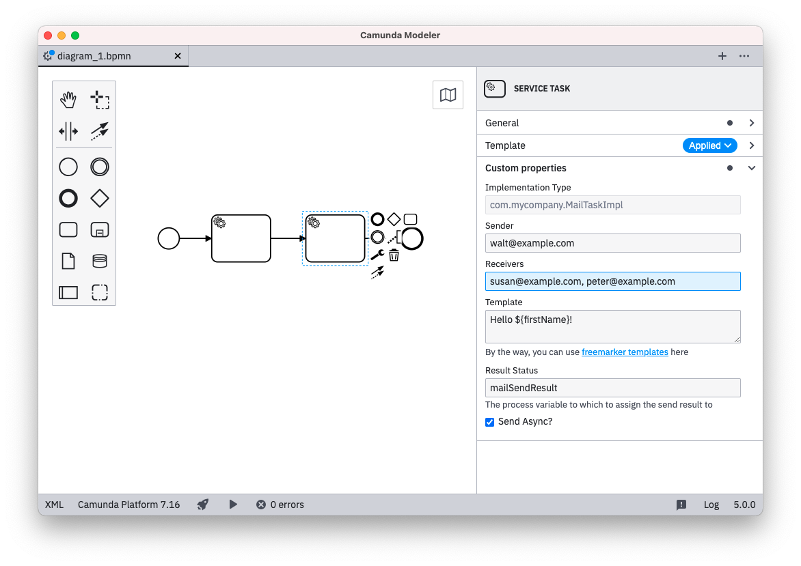
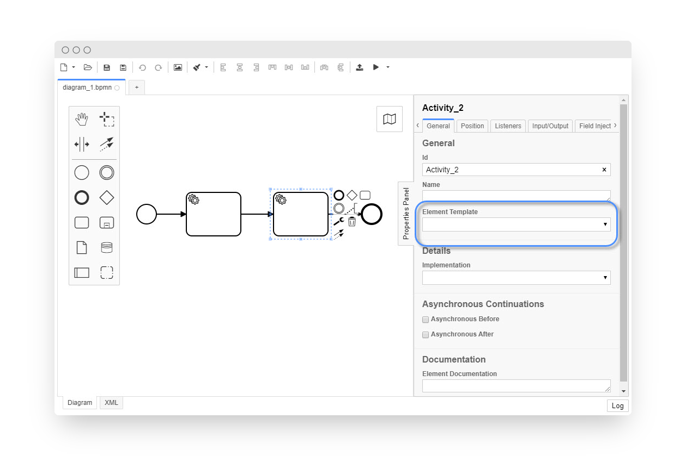
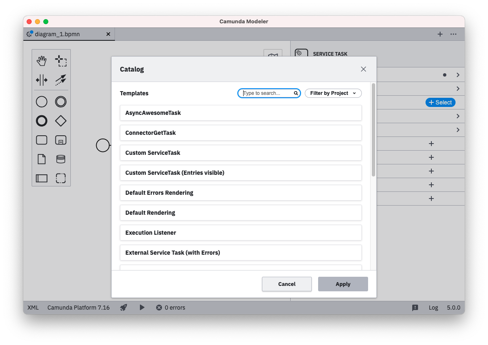
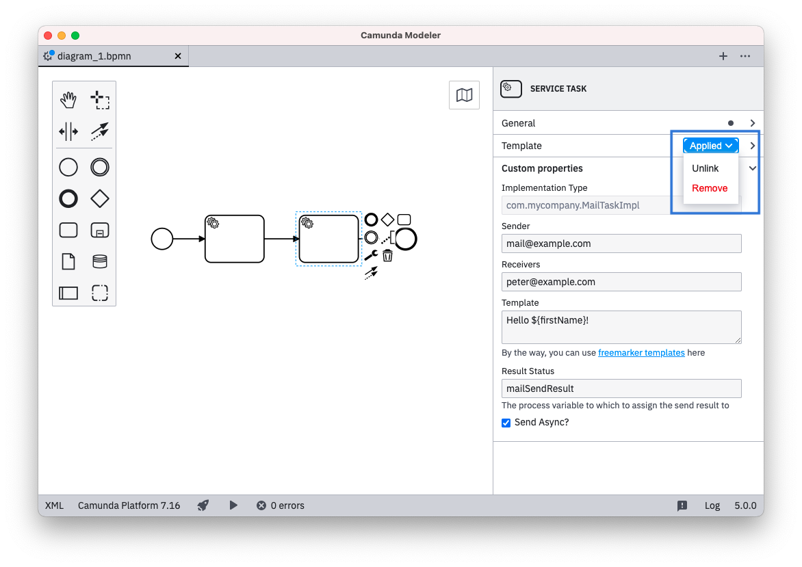
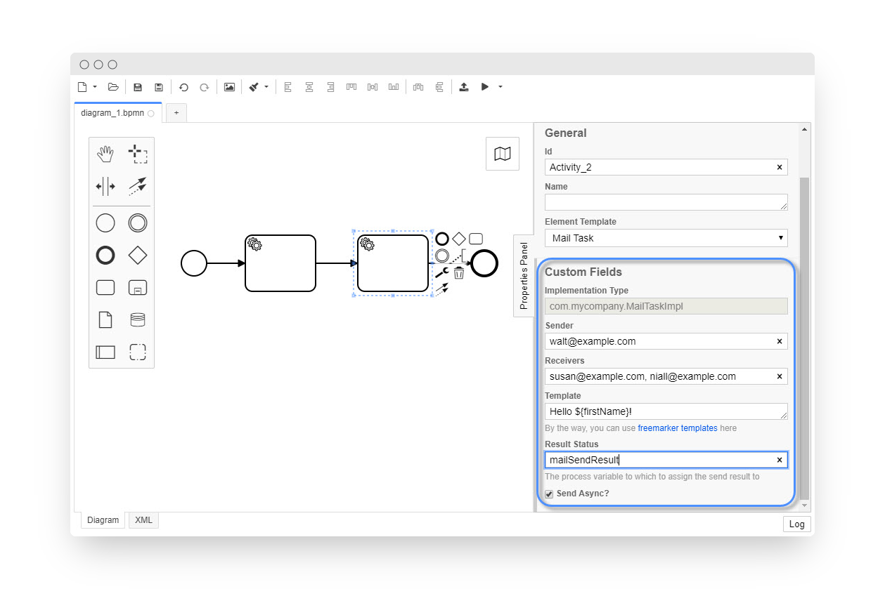
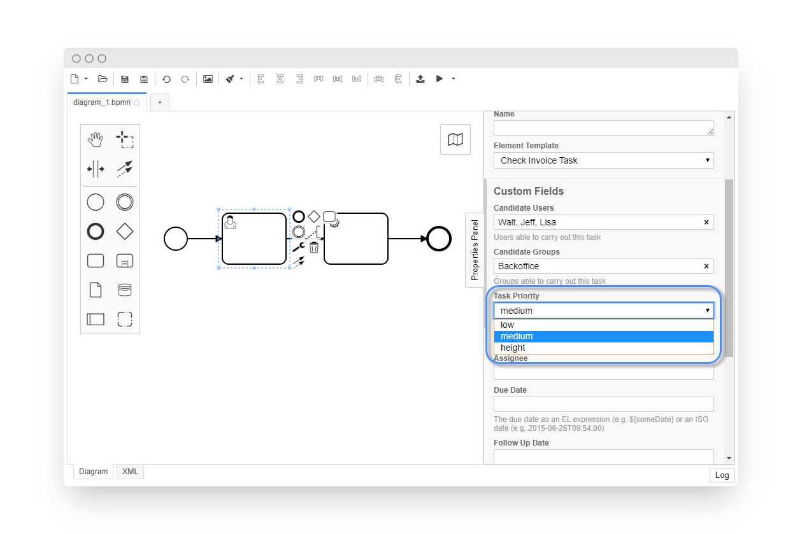
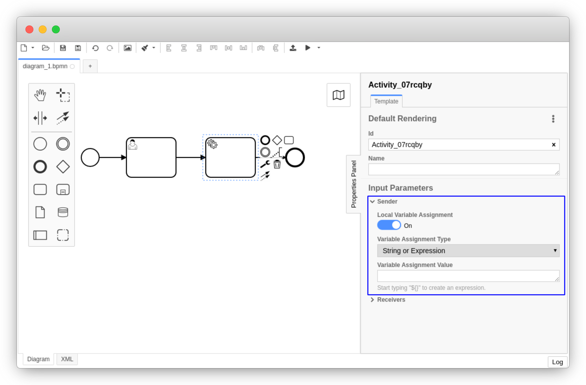
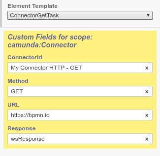

# Element Templates

Element templates allow you to create pre-defined configurations for BPMN elements such as service and user tasks. Once applied via the properties panel they provide configured custom inputs to the user.




## Configuring Templates

Element templates are defined as [JSON files](#defining-templates). There are two ways to integrate them into the Camunda Modeler:

1. **Retrieve from Cawemo:** use the [Camunda Cloud Connect plugin](https://docs.camunda.org/cawemo/latest/technical-guide/integrations/modeler/) to integrate the Camunda Modeler with [Cawemo](https://cawemo.com/). The Modeler can then retrieve templates from catalog projects setup in Cawemo.
2. **Local filesystem:** Store element templates as `.json` file in the `resources/element-templates` folder, relative to the modelers executable _or_ relative to the modelers data directory ([see below](#example-setup)). Alternatively, they can be stored in a `.camunda/element-templates` directory that resides, relative to the currently opened diagram, anywhere in the diagrams path hierarchy.

New templates will be recognized when reconnecting to Cawemo or on Camunda Modeler reload/restart.


#### Example Setup


Add a `.json` file to the `resources/element-templates` sub-folder of your local [`{APP_DATA_DIRECTORY}`](../search-paths#app-data-directory) or [`{USER_DATA_DIRECTORY}`](../search-paths#user-data-directory) directory. You may have to create the `resources` and `element-templates` folders  yourself.

For local template discovery, create a `.camunda/element-templates` folder relative in the directory
or any parent directory of the diagrams you are editing.


## Using Templates

If a template matches a selected diagram element, the template catalog button will be shown in the properties panel.



Clicking the `Catalog` button will bring up a modal menu allowing to browse and search available templates for the selected element.



Applying a template will store it via the `camunda:modelerTemplate` property on the selected element:

```xml
<bpmn:serviceTask id="MailTask" camunda:modelerTemplate="com.mycompany.MailTask" />
```

It will also setup custom fields on the diagram element and make these available to the user for inspection and editing. Properties which were not configured in the element template using custom fields, will not be available for editing for the user.

To remove an applied template from an element, either the *Unlink* or *Remove* function can be used:

* *Remove*: Remove the element template from the `camunda:modelerTemplate` property and also reset all properties of the respective element.
* *Unlink*: Remove the element template from the `camunda:modelerTemplate` property but keep the properties which were set.



If a template is applied to an element but the respective template cannot be found on the system, the editing of the element will be disabled. Either *removing* the template for the element or adding the element template config will enable the editing again.


## Defining Templates

Templates are defined in template descriptor files as a JSON array:

```json
[
  {
    "name": "Template 1",
    "id": "sometemplate",
    "appliesTo": [
      "bpmn:ServiceTask"
    ],
    "properties": [
      ...
    ]
  },
  {
    "name": "Template 2",
    ...
  }
]
```

As seen in the code snippet a template consist of a number of important components:

* `name`: Identifier to appear in the template chooser
* `id`: Unique id of the template
* `appliesTo`: List of BPMN types the template can be assigned to
* `properties`: List of properties that are defined on the template


### Defining Template Properties

With each template, you define some user-editable fields as well as their mapping to BPMN 2.0 XML as well as Camunda extension elements.

Let us consider the following example that defines a template for a mail sending task:

```json
{
  "name": "Mail Task",
  "id": "com.camunda.example.MailTask",
  "appliesTo": [
    "bpmn:ServiceTask"
  ],
  "properties": [
    {
      "label": "Implementation Type",
      "type": "String",
      "value": "com.mycompany.MailTaskImpl",
      "editable": false,
      "binding": {
        "type": "property",
        "name": "camunda:class"
      }
    },
    {
      "label": "Sender",
      "type": "String",
      "binding": {
        "type": "camunda:inputParameter",
        "name": "sender"
      },
      "constraints": {
        "notEmpty": true
      }
    },
    {
      "label": "Receivers",
      "type": "String",
      "binding": {
        "type": "camunda:inputParameter",
        "name": "receivers"
      },
      "constraints": {
        "notEmpty": true
      }
    },
    {
      "label": "Template",
      "description": "By the way, you can use freemarker templates ${...} here",
      "value": "Hello ${firstName}!",
      "type": "Text",
      "binding": {
        "type": "camunda:inputParameter",
        "name": "messageBody",
        "scriptFormat": "freemarker"
      },
      "constraints": {
        "notEmpty": true
      }
    },
    {
      "label": "Result Status",
      "description": "The process variable to which to assign the send result to",
      "type": "String",
      "value": "mailSendResult",
      "binding": {
        "type": "camunda:outputParameter",
        "source": "${ resultStatus }"
      }
    },
    {
        "label": "Async before?",
        "type": "Boolean",
        "binding": {
            "type": "property",
            "name": "camunda:asyncBefore"
        }
    }
  ]
}
```

The example defines five custom fields, each mapped to different technical properties:

* _Implementation Type_ is mapped to the `camunda:class` property in BPMN 2.0 XML
* _Sender_, _Receivers_ and _Template_ properties are mapped to [input parameters]()
* _Result Status_ is mapped back from the Java Delegate into a process variable via an [output parameter]()

All but the _Implementation Type_ are editable by the user through the properties panel as shown in the following screenshot:




As seen in the example the important attributes in a property definition are:

* `label`: A descriptive text shown with the property
* `type`: Defining the visual appearance in the properties panel (may be any of `String`, `Text`, `Boolean`, `Dropdown` or `Hidden`)
* `value`: An optional default value to be used if the property to be bound is not yet set
* `binding`: Specifying how the property is mapped to BPMN or Camunda extension elements and attributes (may be any of `property`, `camunda:property`, `camunda:inputParameter`, `camunda:outputParameter`, `camunda:in`, `camunda:out`, `camunda:executionListener`, `camunda:field`)
* `constraints`: A list of editing constraints to apply to the template


#### Types

The input types `String`, `Text`, `Boolean`, `Dropdown` and `Hidden` are available. As seen above `String` maps to a single-line input, `Text` maps to a multi-line input.


###### Boolean / Checkbox Type

The `Boolean` type maps to a checkbox that can be toggled by the user. It renders as shown below:


When checked, it maps to `true` in the respective field (see [bindings](#Bindings)). Note that is does not map to `${true}` and can therefore not be used e.g., for mapping a boolean to a process variable.

###### Dropdown Type

The `Dropdown` type allows users to select from a number of pre-defined options that are stored in a custom properties `choices` attribute as `{ name, value }` pairs:

```json
...
  "properties": [
    ...
    {
      "label": "Task Priority",
      "type": "Dropdown",
      "value": "50",
      "choices": [
        { "name": "low", "value": "20" },
        { "name": "medium", "value": "50" },
        { "name": "height", "value": "100" }
      ]
    }
  ]
...
```

The resulting properties panel control looks like this:



###### Omitted Type

By omitting the `type` configuration the default UI component will be rendered for the respective binding.

For `camunda:inputParameter` and `camunda:outputParameter` bindings an Input / Output Parameter Mapping component will be rendered. The component will include a toggle to enable or disable the `Variable Assignment`. When untoggling, the respective `camunda:inputParameter` or `camunda:outputParameter` element will not be created in the BPMN XML.



Note that the configuration options `editable` and `constraints` will have no effect for the `camunda:inputParameter` and `camunda:outputParameter` default component.

For the `property`, `camunda:property`, `camunda:in`, `camunda:in:businessKey`, `camunda:out` and `camunda:field` bindings, an omitted `type` will lead to rendering the `String` component (single line input).

For the `camunda:executionListener` binding, an omitted `type` will lead to the `Hidden` component (ie. no visible input for the user).


#### Bindings

The following ways exist to map a custom field to the underlying BPMN 2.0 XML. The _"mapping result"_ in the following section will use `[userInput]` to indicate where the input provided by the user in the `Properties Panel` is set in the BPMN XML. As default or if no user input was given, the value specified in `value` will be displayed and used for `[userInput]`. `[]` brackets will be used to indicate where the parameters are mapped to in the XML.

Notice that adherence to the following configuration options is not enforced. Not-adherence might lead to errors when using element templates.

##### `property`

| **Binding `type`**  | `property`  |
|---|---|
| **Valid property `type`'s** | `String`<br />`Hidden`<br />`Dropdown`<br />`Boolean` |
| **Binding parameters**  | `name`: the name of the property  |
| **Mapping result** | `<... [name]=[userInput] ... />`  |

##### `camunda:property`

| **Binding `type`**  | `camunda:property`  |
|---|---|
| **Valid property `type`'s** | `String`<br />`Hidden`<br />`Dropdown` |
| **Binding parameters**  | `name`: the name of the extension element property  |
| **Mapping result** | `<camunda:property name="[name]" value="[userInput]" />`  |

##### `camunda:inputParameter`

| **Binding `type`**  | `camunda:inputParameter`  |
|---|---|
| **Valid property `type`'s** | `String`<br /> `Text`<br />`Hidden`<br />`Dropdown` |
| **Binding parameters**  | `name`: the name of the input parameter<br />`scriptFormat`: the format of the script (if script is to be mapped)  |
| **Mapping result** | If `scriptFormat` is not set:<br />`<camunda:inputParameter name="[name]">[userInput]</camunda:inputParameter>`<br /><br />If `scriptFormat` is set:<br />`<camunda:inputParameter name="[name]"><camunda:script scriptFormat="[scriptFormat]">[userInput]</camunda:script></camunda:inputParameter>`  |

##### `camunda:outputParameter`

|  **Binding `type`**  |  `camunda:outputParameter` |
|---|---|
| **Valid property `type`'s** | `String`<br />`Hidden`<br />`Dropdown` |
| **Binding parameters**  | `source`: the source value to be mapped to the `outputParameter`<br />`scriptFormat`: the format of the script (if script is to be mapped)  |
| **Mapping result (example)** | If `scriptFormat` is not set:<br />`<camunda:outputParameter name="[userInput]">[source]</camunda:inputParameter>`<br /><br />If `scriptFormat` is set:<br />`<camunda:outputParameter name="[userInput]"><camunda:script scriptFormat="[scriptFormat]">[source]</camunda:script></camunda:outputParameter>`  |

##### `camunda:in`

|  **Binding `type`**  |  `camunda:in` |
|---|---|
| **Valid property `type`'s** | `String`<br />`Hidden`<br />`Dropdown` |
| **Binding parameters**  | `target`: the target value to be mapped to<br />`expression`: `true` indicates that the userInput is an expression<br />`variables`: either `all` or `local` indicating the variable mapping  |
| **Mapping result** | If `target` is set:<br />`<camunda:in source="[userInput]" target="[target]"/>`<br /><br />If `target` is set and `expression` is set to `true`:<br />`<camunda:in sourceExpression="[userInput]" target="[target]" />`<br /><br /> If `variables` is set to `local`:<br />` <camunda:in local="true" variables="all" />` (Notice there is no `[userInput]`, therefore has to use property `type` of value `Hidden`)<br /><br />If `variables` is set to `all`:<br />`<camunda:in variables="all" />` (Notice there is no `[userInput]`, therefore has to use property `type` of value `Hidden`) |

##### `camunda:in:businessKey`

|  **Binding `type`**  |  `camunda:in:businessKey` |
|---|---|
| **Valid property `type`'s** | `String`<br />`Hidden`<br />`Dropdown` |
| **Binding parameters**  |  |
| **Mapping result** | `<camunda:in businessKey="[userInput]" />` |

##### `camunda:out`

|  **Binding `type`**  |  `camunda:out` |
|---|---|
| **Valid property `type`'s** | `String`<br />`Hidden`<br />`Dropdown` |
| **Binding parameters**  |  `source`: the source value to be mapped<br />`sourceExpression`: a string containing the expression for the source attribute<br />`variables`: either `all` or `local` indicating the variable mapping  |
| **Mapping result** | If `source` is set:<br />`<camunda:out source="[source]" target="[userInput]" />`<br /><br />If `sourceExpression` is set:<br />`<camunda:out sourceExpression="[sourceExpression]" target="[userInput]" />`<br /><br />If `variables` is set to `all`:<br />`<camunda:out variables="all" />` (Notice there is no `[userInput]`, therefore has to use property `type` of value `Hidden`)<br /><br />If `variables` is set to `local`:<br />`<camunda:out local="true" variables="all" />` (Notice there is no `[userInput]`, therefore has to use property `type` of value `Hidden`) |

##### `camunda:executionListener`

|  **Binding `type`**  |  `camunda:executionListener` |
|---|---|
| **Valid property `type`'s** | `Hidden` |
| **Binding parameters**  | `event`: value for the `event` attribute<br />`scriptFormat`: value for the `scriptFormat` attribute |
| **Mapping result** | `<camunda:executionListener event="[event]"><camunda:script scriptFormat="[scriptFormat]">[value]</camunda:script></camunda:executionListener>`<br />(Notice that `[value]` needs to be set, since only `Hidden` is allowed as a type hence the user can not set a `[userInput]`) |

##### `camunda:field`

|  **Binding `type`**  |  `camunda:field` |
|---|---|
| **Valid property `type`'s** | `String`<br /> `Text`<br />`Hidden`<br />`Dropdown` |
| **Binding parameters**  | `name`: value for the `name` attribute<br />`expression`: `true` that an expression is passed |
| **Mapping result** | `<camunda:field name="[name]"><camunda:string>[userInput]</camunda:string></camunda:field>`<br /><br />If `expression` is set to `true`:<br />`<camunda:field name="[name]"><camunda:expression>[userInput]</camunda:expression>` |

#### Scoped Bindings

As of Camunda Modeler `v1.11.0` we support special scoped bindings that allow you to configure nested elements, such as [connectors](https://docs.camunda.org/manual/7.7/user-guide/process-engine/connectors/#use-connectors).

```json
{
  "name": "ConnectorGetTask",
  "id": "my.connector.http.get.Task",
  "appliesTo": [
    "bpmn:Task"
  ],
  "properties": [],
  "scopes": {
    "camunda:Connector": {
      "properties": [
        {
          "label": "ConnectorId",
          "type": "String",
          "value": "My Connector HTTP - GET",
          "binding": {
            "type": "property",
            "name": "connectorId"
          }
        },
        ...
      ]
    }
  }
}
```

The example shows how a connector is configured as part of the task.
On task creation, the connector is created with it and the connector bindings are
exposed to the user in a separate custom fields section.




__Supported Scopes__


| Name | Target |
| ------------- | ------------- |
| `camunda:Connector` | [Connectors](https://docs.camunda.org/manual/7.7/user-guide/process-engine/connectors/) |


#### Constraints

Custom Fields may have a number of constraints associated with them:

* `notEmpty`: Input must be non-empty
* `minLength`: Minimal length for the input
* `maxLength`: Maximal length for the input
* `pattern`: Regular expression to match the input against


##### Regular Expression

Together with the `pattern` constraint, you may define your custom error messages:

```json
...
  "properties": [
    {
      "label": "Web service URL",
      "type": "String",
      "binding": { ... },
      "constraints": {
        "notEmpty": true,
        "pattern": {
          "value": "https://.*",
          "message": "Must be https URL"
        }
      }
    }
  ]
```


## Default Templates

A default template provides properties that are automatically applied for
all newly created elements of a specific kind.

To mark a template as _default_ set the `isDefault` property on the template to `true`:

```json
[
  {
    "name": "Template 1",
    "id": "sometemplate",
    "isDefault": true,
    "appliesTo": [
      "bpmn:ServiceTask"
    ],
    "properties": [
      ...
    ]
  }
]
```

Other templates may not be applied, once an element is subject to a default template.


## Development Workflow

When creating custom element templates, the modeler will give you detailed validation error messages.

Templates will be loaded on application load and reload. To reload the application with updated templates, open the developer tools `F12` and press `CtrlOrCmd+R`. This will clear all unsaved diagrams **!**


## Supported BPMN Types

Currently, element templates may be used on the following BPMN elements:

* `bpmn:Activity` (including tasks, service tasks, and others)
* `bpmn:SequenceFlow` (for maintaining `condition`)
* `bpmn:Process`
* `bpmn:Event`


## Learn more

Use the [Camunda Cloud Connect plugin](https://docs.camunda.org/cawemo/latest/technical-guide/integrations/modeler/) to integrate the Camunda Modeler with [Cawemo](https://cawemo.com/) and retrieve templates from a Cawemo catalog project.

Try playing around with custom elements and some [example templates](https://github.com/camunda/camunda-modeler/blob/master/resources/element-templates/samples.json).

If you get stuck, ask for help [in our forums](https://forum.camunda.org/c/modeler).
