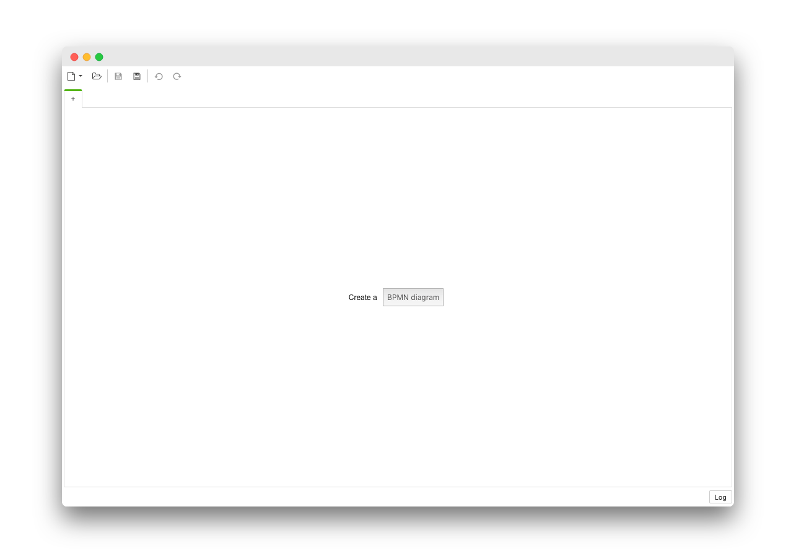

> :warning: This feature got introduced in Camunda Modeler `v3.0.0` and may be subject to change at any time.


# Flags

Flags allow you to control the availability of certain features within the application.


## Configuring Flags

You may configure flags in a `flags.json` file or pass them via CLI.

### Configure in `flags.json`

Place a `flags.json` file inside the `{APP_HOME}/resources` or `{USER_DATA}/resources` directory to persist them.

### Configure via CLI

Pass flags via the command line when starting the application. 

```
camunda-modeler --disable-plugins
```

Flags passed as command line arguments take precedence over those configured via a configuration file.


## Available Flags

```json
{
  "disable-plugins": false,
  "disable-adjust-origin": false,
  "disable-cmmn": false,
  "disable-dmn": false
}
```


## Examples

### BPMN-only Mode

To disable the CMMN and DMN editing capabilities of the App, configure your `flags.json` like this:

```js
{
    "disable-cmmn": true,
    "disable-dmn": true
}
```

As a result, the app will only allow users to model BPMN diagrams.


