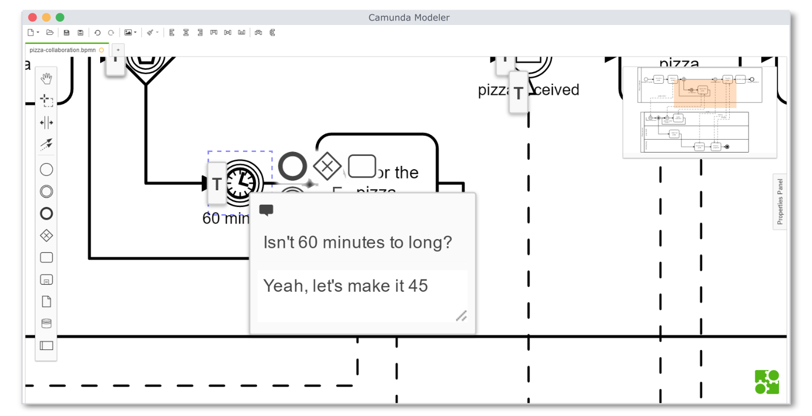

> The feature Plugins is experimental and may be subject to change in the future.

# Plugins :electric_plug:

Plugins allow you to plug into different parts of the modeler.



## Plugging into the Camunda Modeler

You can plug into the modeler in order to change its appearance, add new menu entries or extend the modeling tools for [BPMN](https://github.com/bpmn-io/bpmn-js), [CMMN](https://github.com/bpmn-io/cmmn-js) and [DMN](https://github.com/bpmn-io/dmn-js). Adding a plugin is as easy as putting the files into the modelers `plugins` directory. So let's dive into how to add your own plugins.

Regardless of the type of your plugin you have to export it as a [Node.js module](https://nodejs.org/api/modules.html). In order for the modeler to recognize your plugin the filename must be `index.js`.

Example:

```javascript
module.exports = {
  name: 'My Awesome Plugin', // the name of your plugin
  style: './style.css', // changing the appearance of the modeler
  menu: './menu.js', // adding menu entries to the modeler
  script: './script.js' // extend the modeling tools for BPMN, CMMN and DMN
};
```
The modeler will automatically load your plugins on startup.

## Changing the appearance of the modeler

You can change the appearance of the modeler with CSS.

Your stylesheet might look like this:

```css
body {
  background: linear-gradient(0deg, #52b415, #eee);
}
```

Plug it into the modeler like this:

```javascript
module.exports = {
  style: './style.css'
};
```

## Adding menu entries to the modeler

You can add new menu entries to the modelers menu.

Describe your menu entries like this:

```javascript
module.exports = function(electronApp, menuState) {
  return [{
    label: 'Open BPMN Reference',
    accelerator: 'CommandOrControl+[',
    enabled: function() {

      // only enabled for BPMN diagrams
      return menuState.bpmn;
    },
    action: function() {
      var shell = require('electron').shell;
      shell.openExternal('https://camunda.org/bpmn/reference/');
    }
  }];
});
```

Plug them into the modeler like this:

```javascript
module.exports = {
  menu: './menu-entries'
};
```

You can use a Node.js module here since the modeler is built with [Electron](https://electron.atom.io/) which uses [Node.js](https://nodejs.org/en/).

For more information on how the modelers menu works have a look at its implementation [here](https://github.com/camunda/camunda-modeler/blob/master/app/lib/menu/menu-builder.js).

## Extend the modeling tools for BPMN, CMMN and DMN

> Currently you can only extend bpmn-js

You can extend the modeling tools for [BPMN](https://github.com/bpmn-io/bpmn-js), [CMMN](https://github.com/bpmn-io/cmmn-js) and [DMN](https://github.com/bpmn-io/dmn-js) with your own modules.

Since the client of the modeler uses [Chromium](https://www.chromium.org/Home) you can't use Node.js modules to extend the modeling tools. You need to bundle your plugin first. The easiest way to get started with client-side plugins is through [this](https://github.com/camunda/camunda-modeler-plugin-example) example project.

First, clone the repository:

```
git clone https://github.com/camunda/camunda-modeler-plugin-example.git
```

Next, install the dependencies:

```
npm install
```

Now, create your module:

```javascript
function LoggingPlugin(eventBus) {
  eventBus.on('shape.added', function() {
    console.log('A shape was added to the diagram!');
  });
}

module.exports = {
  __init__: [ 'loggingPlugin' ],
  loggingPlugin: [ 'type', LoggingPlugin ]
};
```

Make sure to require your file in `client.js`:

```javascript
var registerClientPlugin = require('./registerClientPlugin');
var module = require('./LoggingPlugin');

registerClientPlugin({
  type: 'bpmn.modeler.additionalModules',
  module: module
});
```

Bundle your plugin:

```
npm run client
```

Finally, put the folder into the `plugins` directory of the Camunda Modeler. You can now use your plugin!
