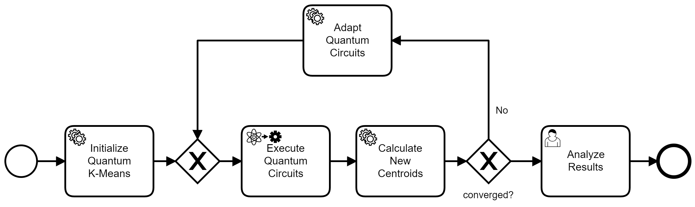
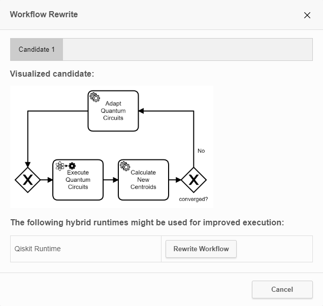
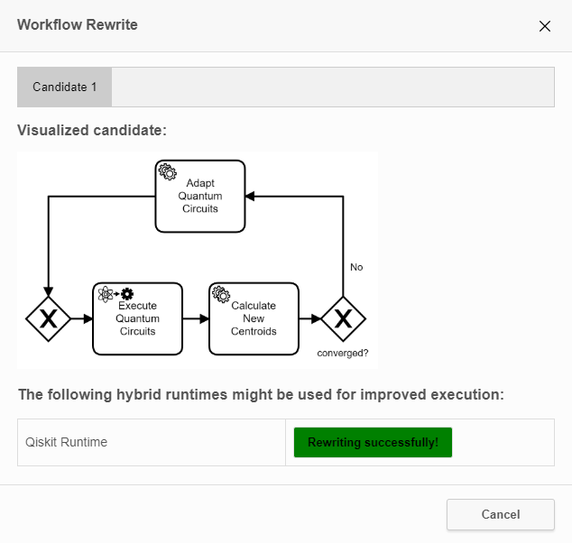
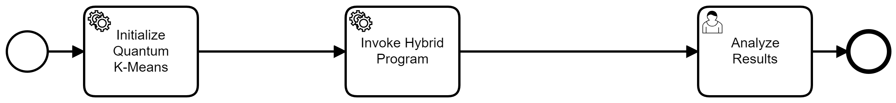

# Analysis and Rewrite

The analysis-and-rewrite feature of the QuantME Transformation Framework enables detecting hybrid loops comprising quantum and classical tasks in a workflow.
These workflow fragments can benefit from hybrid runtimes, such as the [Qiskit Runtime](https://quantum-computing.ibm.com/lab/docs/iql/runtime/).
Hybrid runtimes enable uploading the quantum and classical programs of hybrid loops together and optimizing their execution.
Thus, they are more efficient than orchestrating the programs using a workflow.
However, to benefit from the modeling advantages of workflows, such as the understandable graphical notation or the easy exchange of certain tasks within the hybrid loop, workflow fragments that can benefit from hybrid runtimes should be automatically detected.
Then, a hybrid program corresponding to the workflow fragment can be generated and the workflow is rewritten to invoke it.
This functionality is provided by the analysis-and-rewrite feature.

## Example

In the following, a small example for the usage of the analysis-and-rewrite feature is presented.
Furthermore, a more sophisticated example is available in [this repository](https://github.com/UST-QuAntiL/QuantME-UseCases/tree/master/2022-closer).

### Exemplary Workflow Model

The figure below shows an exemplary workflow model comprising a hybrid loop:

Thereby, the tasks in between the two XOR gateways implement the quantum k-means clustering algorithm.
This means the hybrid loop comprises two classical and one quantum task.
Click on the ``Improve Hybrid Loops`` button in the toolbar, and then on the ``Analyse Workflow`` button, which opens the following pop-up:

The pop-up displays a graphical representation of all found hybrid loops, i.e., one candidate in this example.
Furthermore, the set of supported hybrid runtimes is listed below the candidate.
Currently, only the Qiskit Runtime is supported.
To start the hybrid program generation and workflow rewrite, press the ``Rewrite Workflow`` button.
Wait until the rewriting finishes, which is indicated by the status message and the color of the button:

Close the pop-up and inspect the rewritten workflow model:

It now comprises one service task invoking a hybrid program within Qiskit Runtime instead of the hybrid loop.
Furthermore, a corresponding deployment model to upload the hybrid program is generated and attached to the service task.

## Limitations

The Qiskit Runtime is currently in beta mode and some restrictions apply.
Furthermore, the analysis-and-rewrite feature has also some limitations.
Both kinds of limitations are discussed in the following.

### Loop Detection

The loop detection is currently restricted to loops comprising a splitting and merging XOR gateway.
This means, one XOR gateway is the entry point and one the exit point, as shown in the exemplary workflow model above.
Other kinds of loops, e.g., using event based-gateways or splitting and merging with conditional sequence flow, are currently not supported.

Furthermore, the loops are not allowed to contain additional gateways or parallel paths, as this has to be serialized within the generated hybrid program.
However, the integration of an automated serialization of multiple contained paths is planned to be added in the future.

### Hybrid Programs and Source Programs

Qiskit Runtime currently does not support including custom dependencies into the executable hybrid programs (see [here](https://qiskit.org/documentation/partners/qiskit_runtime/tutorials/sample_vqe_program/qiskit_runtime_vqe_program.html)).
Instead, they only support a small set of pre-installed dependencies, e.g., the Qiskit or mthree libraries.
Therefore, the quantum and classical programs of the hybrid loop are currently also restricted to these dependencies.

Additionally, Qiskit Runtime only supports a single Python file representing the hybrid program.
This means all quantum and classical programs have to be merged into this single Python file.
For the sake of simplicity, each of the quantum and classical programs is restricted to a single file too.

The different quantum and classical programs should provide a ``main``-method to start their processing.
This method is then included with all dependent methods and imports into the hybrid program.
Furthermore, it is used to determine the interface, i.e., the input and output parameters of the program.

The execution of the quantum circuits within the quantum programs of the hybrid loops should be done using the ``qiskit.execute`` method.
This method is then replaced by a call to the Qiskit Runtime specific backend object including the circuit to be executed.

### Task and Event Types

Calls to the internet are not allowed within a Qiskit Runtime program for security reasons.
Thus, throwing events are not permitted within hybrid loops, as they can not be mapped to some invocation outside the Qiskit Runtime environment.
Furthermore, only script and service tasks are supported by the QuantME Transformation Framework representing quantum and classical programs.
Other tasks, such as human tasks, can not be meaningfully integrated into hybrid programs.

### Data Handling

The input and output of hybrid programs are limited to variables of type string.
Variables of other types should be converted into a string before passing them or retrieving them from the hybrid program.
As the Camunda Engine restricts the size of string variables, the string can also be stored as a file variable within Camunda.
