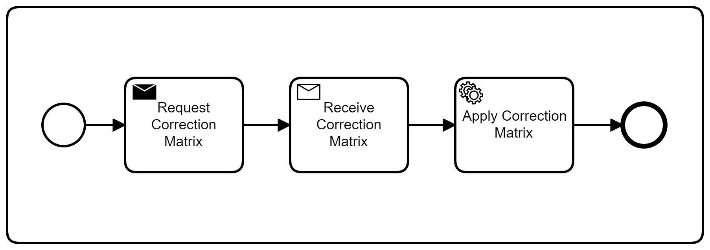

# QuantME Replacement Models (QRMs)

_QuantME Replacement Models (QRMs)_ define workflow fragments that can be used to transform QuantME workflows to workflows using only native modeling constructs of the host workflow language.
Therefore, they define a _detector_ that defines which kind of QuantME task can be replaced by the QRM and a _replacement fragment_ containing the workflow fragment to replace the matching QuantME tasks.
In the following, both constructs are introduced and it is shown how they can be created and used with the QuantME modeling and transformation framework.

### Detector

The detector part of a QRM is a BPMN diagram, defining which QuantME tasks can be replaced by the QRM.
Therefore, they contain exactly one QuantME task with a set of properties.
An example detector can be found [here](./detector.bpmn).

The important part of the detector is listed bellow:

```xml
  <bpmn:process id="Process_03e1olx" isExecutable="true">
    <quantme:readoutErrorMitigationTask id="Task_0z5udr0" unfoldingTechnique="Correction Matrix" qpu="ibmq_rome, ibmq_london" maxAge="*" />
  </bpmn:process>
```

The detector defines a `quantme:readoutErrorMitigationTask`, and thus, can be used to replace QuantME tasks of this type in QuantME workflows.
Details about this matching process can be found in the _Detector Task Matching_ section bellow.

#### Alternative Properties

Alternative properties are sets of properties of QuantME tasks for which exactly one property has to be defined.
For example, the `quantme:quantumCircuitLoadingTask` defines the two alternative properties `quantumCircuit` and `url`.
This allows to specify alternative possibilities to load the quantum circuit into the workflow.
However, if none of the properties is set, it is not possible to load the quantum circuit successfully.
In the same way, if both properties are set, it is unclear which circuit to use.
Therefore, exactly one of these alternative properties has to be set for each task in a QuantME workflow.

In the detector, it is possible to set values for multiple alternative properties if the replacement fragment can handle different alternatives.
However, in contrast to all other properties, it is also possible to leave alternative properties empty if at least one of them is set.

There are currently two QuantME task types using alternative properties: 

1. `quantme:quantumCircuitLoadingTask`: The properties `quantumCircuit` and `url` are alternatives
2. `quantme:oracleExpansionTask`: The properties `oracleCircuit` and `oracleURL` are alternatives

#### Detector Task Matching

A detector has to define all properties of the contained QuantME task, except for alternative properties, for which at least one property has to be set.
Thereby, for each property there are three different ways to define a value: 

1. Exactly one value, which means the detector only matches QuantME tasks that define exactly the same value for this property (see `unfoldingTechnique` in the XML snipped above).
2. A list of possible values, which means the detector matches all QuantME tasks that have one of these values defined for this property (see `qpu` in the XML snipped above).
3. A wildcard, which means the detector matches all QuantME tasks independent of their value for this property (see `maxAge` in the XML snipped above)

Thus, the detector matches a QuantME task, if all properties can be matched successfully, and then the replacement fragment can be used to replace the matched tasks in a QuantME workflow during transformation.

Note: If a QuantME task in a QuantME workflow does not define an optional property, this matches each detector independent of its value for this property. 

### Replacement Fragment

As the detector, the replacement fragment part of a QRM is also a BPMN diagram, defining a workflow fragment implementing the functionality to replace QuantME tasks matching the detector.
An example replacement fragment can be found [here](./replacement.bpmn), which is visualized below:



First, the required correction matrix is requested by a send task, then it is received by a receive task, and finally, the correction matrix is applied to the input data which is passed to the subprocess by a variable.

Note: Currently, only one activity element is supported in replacement fragments. Therefore, if the implementation of the QuantME task from the detector requires more than one task, please use a subprocess and wrap each required task into it.
